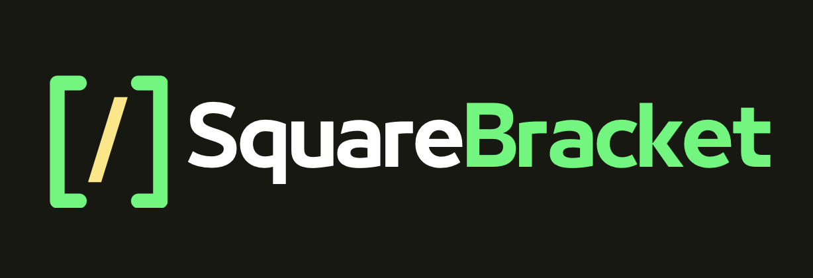

<h1>SQBRA Interpreter <i>(Version 1.3.2)</i></h1>
<h2>Interpreter for the SquareBracket Programming Language</h2>

SquareBracket is a <b>simple programming language</b> designed to make the execution of small algorithms and math scripts easy. It has a syntax that is <b>easy to learn</b> and intuitive commands to perform mathematical operations, create variables, and control program flow. It is designed to be extensible and many <b>more functions will be added in future versions</b> to make it more powerful. With its focus on simplicity and ease of use, SquareBracket is a good choice for anyone looking to quickly and easily create and execute mathematical algorithms and scripts. Small bugs may still occur. The interpreter is lightweight and completely <b>implemented in C++</b>.

<h2>Syntax of the Language:</h2>
<ul>
  <li><b>cvar &lt;variable_name&gt; &lt;initial_value&gt;</b>: Creates a new variable with the given name and assigns it the given initial value.</li>
  <li><b>mvar &lt;variable1&gt; &lt;variable2&gt; ... &lt;variableN&gt; &lt;initial_value&gt;</b>: Creates multiple variables at once with the same initial value.</li>
  <li><b>set &lt;variable_name&gt; (&lt;expression&gt;)</b>: Assigns the value of the given expression to the variable with the given name.</li>
  <li><b>if (&lt;statement&gt;) [</b><i>code block</i><b>]</b>: Executes the code block if the given statement is true.</li>
  <li><b>while (&lt;statement&gt;) [</b><i>code block</i><b>]</b>: Repeatedly executes the code block as long as the given statement is true.</li>
  <li><b>loop &lt;variable_name&gt; &lt;iterations&gt; do [</b><i>code block</i><b>]</b>: Repeatedly executes the code block the specified number of times, decrementing the given variable each time.</li>
  <li><b>sloop &lt;variable_name&gt; &lt;iterations&gt; do [</b><i>code block</i><b>]</b>: Same as loop, but changes to the variable inside the code block do not affect the loop.</li>
  <li><b>sin &lt;target&gt; &lt;source&gt;</b>: Calculates the sine of the source and assigns the result to the target.</li>
  <li><b>cos &lt;target&gt; &lt;source&gt;</b>: Calculates the cosine of the source and assigns the result to the target.</li>
  <li><b>tan &lt;target&gt; &lt;source&gt;</b>: Calculates the tangent of the source and assigns the result to the target.</li>
  <li><b>asin &lt;target&gt; &lt;source&gt;</b>: Calculates the inverse sine of the source and assigns the result to the target.</li>
  <li><b>acos &lt;target&gt; &lt;source&gt;</b>: Calculates the inverse cosine of the source and assigns the result to the target.</li>
  <li><b>atan &lt;target&gt; &lt;source&gt;</b>: Calculates the inverse tangent of the source and assigns the result to the target.</li>
  <li><b>sec &lt;target&gt; &lt;source&gt;</b>: Calculates the secant of the source and assigns the result to the target.</li>
  <li><b> loop n do [ ... ]</b>: loop n times and execute the code in the indented block. The variable n is decremented each time.</li>
  <li><b>sloop n do [ ... ]</b>: same as loop, but changes to the loop variable inside the code block do not affect the loop.</li>
  <li><b>if (statement) [ ... ]</b>: execute the code in the indented block if the statement is true. The statement can use the following operators: == (equal), != (not equal), >= (greater or equal), <= (smaller or equal), >> (greater), << (smaller). Example: if (x == 0) [set y 1].</li>
  <li><b>while (statement) [ ... ]</b>: execute the code in the indented block as long as the statement is true. The statement has the same syntax as in the if command.</li>
  <li><b>print ["string"]</b>: print a string and break a new line. Example: print ["Hello, world!"].</li>
  <li><b>printb ["string"]</b>: same as print, but does not break a new line. Example: printb ["Hello, world!"].</li>
  <li><b>printv variable</b>: print the value of a variable and does not break a new line. Example: printv x.</li>
  <li><b>newl</b>: break a new line. Example: newl.</li>
  <li><b>input variable ["string"]</b>: ask for user input and save it in the variable. The optional string is used as a prompt. Example: input x ["Please enter a number: "].</li>
  <li><b>clist name length</b>: create a list with the given name and length. Example: clist my_list 5.</li>
  <li><b>getl variable name</b>: get the length of a list and save it in the variable. Example: getl len my_list.</li>
  <li><b>list[index]</b>: access an element of a list. Example: set my_list[0] 42.</li>
  <li><b>floor x</b>: round down the number x. Example: floor 3.14.</li>
  <li><b>ceil x</b>: round up the number x. Example: ceil 3.14.</li>
  <li><b>round x</b> precision: round the number x to the given number of precision digits. Example: round 3.14159 3.</li>
  </ul>

All commands must be in a single line. Indentation is optional but renders the code more structured and clear.
 

<b>Example:</b>

<code>funct printHello [
    while (var1 != 0) [
        print ["Hello!"]
        set var1 (var1-2)
    ]
]
</code>

<h2>Data Structures:</h2>

In SquareBracket, the only data structures available are doubles and lists of doubles. You can create a new list with the "clist" command followed by the name and the length of the list. You can access elements of the list by indexing the list with square brackets, for example: "my_list[index]". You can also use the "getl" command to get the length of a list and assign it to a variable.

  
